# QUANTR Protocol — libsigrok ↔ STM32 Logic Analyzer

This document describes the text-based communication protocol used between:

* **Host**: libsigrok `quantr` hardware driver  
  (`src/hardware/quantr/protocol.c`, `api.c`, `protocol.h`)
* **Device**: STM32H750VBT6 firmware  
  (`Core/Src/main.c`, `stm32h7xx_it.c`, `qspi_flash.c/h`)

The device appears to the host as a USB CDC ACM serial port (e.g. `/dev/ttyACM0` or `COMx`).

---

## 1. Transport Layer

* **Interface**: USB Full-Speed CDC ACM (virtual serial)
* **Default serial parameters used by libsigrok scan**:
  ```
  921600/8n1/dtr=1/rts=1
  ```
  (Baud rate is ignored by the device; DTR/RTS are asserted to keep the USB link happy.)
* **Line endings**:
  * Device **accepts** commands terminated by `\r` or `\n` (or CRLF).
  * Device **sends** responses and data lines terminated by `\r\n`.
* **Buffering**: Commands are accumulated byte-by-byte in the USB RX callback until a line terminator is seen.

---

## 2. Command / Response Grammar

All commands are plain ASCII, case-sensitive, and terminated by CR/LF.

### 2.1 Commands (Host → Device)

| Command                  | Description                                      | Example                  |
|--------------------------|--------------------------------------------------|--------------------------|
| `ping`                   | Connectivity / presence test                     | `ping\r`                 |
| `rate <Hz>`              | Set sampling rate in Hertz                       | `rate 1000000\r`         |
| `samples <N>`            | Set maximum number of samples to capture         | `samples 10000\r`        |
| `start`                  | Begin acquisition (after config)                 | `start\r`                |
| `stop`                   | Stop acquisition immediately                     | `stop\r`                 |
| `info`                   | Query current configuration                      | `info\r`                 |

**Constraints (enforced on device)**:

* `rate`: 1 Hz … 10 000 000 Hz (10 MHz).  
  The firmware computes TIM1 prescaler/period from the 240 MHz APB2 clock.  
  Note: the error message text currently claims "1000-10000000".
* `samples`: 1 … `BUFFER_DEST_SIZE / 8`  
  - `USE_RAM`: 400 KiB → 51 200 samples max (firmware check allows up to 100 M)  
  - `USE_QPI_FLASH`: 8 MiB → 1 048 576 samples max

### 2.2 Command Responses (Device → Host)

All responses end with `\r\n`.

| Response prefix          | Meaning / Format                                                                 |
|--------------------------|----------------------------------------------------------------------------------|
| `pong`                   | Reply to `ping`                                                                  |
| `rate_ok rate=... Hz, prescaler=..., period=...` | Rate accepted and applied |
| `rate_error: ...`        | Rate out of range or parse error                                                 |
| `samples_ok limit=...`   | Sample limit accepted                                                            |
| `samples_error: ...`     | Sample limit out of range or parse error                                         |
| `start_ok`               | Acquisition will start (RAM mode) or erase will begin (QPI mode)                 |
| `start_erasing 2`        | (QPI only) About to erase flash chip                                             |
| `start_erasing 3`        | (QPI only) Erase complete                                                        |
| `start_erasing 4`        | (QPI only) Timer started, sampling active                                        |
| `stopped`                | Acquisition stopped by `stop` command                                            |
| `command not found`      | Unknown command                                                                  |

`info` currently replies with the same text as the two `_ok` lines concatenated.

---

## 3. Acquisition Data Stream (Device → Host)

After a successful `start`, the device produces the following sequence:

```
started\r\n
0 > 0xAA 0xBB 0xCC 0xDD 0xEE 0xFF 0x11 0x22\r\n
8 > 0x... ...\r\n
...
# Buffer full: collected N bytes\r\n
# Sample limit reached: collected N bytes, M samples\r\n
# Timeout (2s): ...\r\n
end\r\n
```

### 3.1 Data Line Format

```
<decimal_byte_offset> > 0xHH 0xHH 0xHH 0xHH 0xHH 0xHH 0xHH 0xHH\r\n
```

* The decimal number is the **byte offset** in the capture buffer (0, 8, 16, …), **not** a timestamp.
* Exactly 8 bytes follow, each printed as `0xHH` (uppercase hex).
* One line = one 64-bit sample.

### 3.2 Sample Bit Layout (8 bytes, little-endian)

```
Byte 0 = GPIOA[7:0]   (PA0 = LSB of this byte)
Byte 1 = GPIOA[15:8]  (PA8 = LSB of this byte)
Byte 2 = GPIOB[7:0]
Byte 3 = GPIOB[15:8]
Byte 4 = GPIOC[7:0]
Byte 5 = GPIOC[15:8]
Byte 6 = GPIOD[7:0]
Byte 7 = GPIOD[15:8]
```

In the 64-bit integer captured by the ISR:

```
bit  0..15  → PA0..PA15
bit 16..31  → PB0..PB15
bit 32..47  → PC0..PC15
bit 48..63  → PD0..PD15
```

libsigrok maps these to channels **CH0..CH63** (CH0 = PA0, CH15 = PA15, CH16 = PB0, … CH63 = PD15).

### 3.3 Termination Reasons

The comment line before `end\r\n` indicates why acquisition stopped:

* Buffer full (RAM or flash capacity reached)
* Sample limit reached (`sample_count >= limit_samples`)
* Timeout (the firmware currently does **not** implement a 2 s software timeout; the message is legacy)

---

## 4. Session Lifecycle (libsigrok view)

```
scan
  serial_open(921600/8n1/dtr=1/rts=1)
  drain
  write("ping\r")
  read until "pong" seen (up to 2 s)
  create sr_dev_inst + 64 channels + 8 channel groups
  serial_close()

dev_open
  serial_open()
  write("rate <current>\r")   (best-effort)

config_set(SR_CONF_SAMPLERATE)
  if ACTIVE: write("rate <N>\r")

config_set(SR_CONF_LIMIT_SAMPLES)
  if ACTIVE: write("samples <N>\r")

dev_acquisition_start
  write("rate <N>\r"); read ack
  write("samples <N>\r"); read ack
  write("start\r")
  serial_source_add(..., quantr_receive_data)

quantr_receive_data (polling callback)
  read bytes
  accumulate until \r or \n
  process_line()
    "started"  → std_session_send_df_header()
    "end"      → std_session_send_df_end(); stop
    data line  → parse 9 values, build 8-byte sample,
                 sr_session_send(SR_DF_LOGIC, unitsize=8, length=8)
                 if samples_collected >= limit && !continuous → stop

dev_acquisition_stop
  serial_source_remove()
  write("stop\r")
  if started: std_session_send_df_end()
```

---

## 5. RAM vs QPI Flash Modes (Device)

Defined in `main.h`:

```c
#define USE_RAM
//#define USE_QPI_FLASH
```

| Aspect              | USE_RAM                          | USE_QPI_FLASH (W25Q64JV)                  |
|---------------------|----------------------------------|-------------------------------------------|
| Buffer location     | 400 KiB internal D1 RAM          | 8 MiB external NOR via QUADSPI (0x90000000) |
| Max samples         | 51 200                           | 1 048 576                                 |
| Write speed         | Full TIM1 rate (up to ~10 MHz)   | ~1–10 kHz effective (page program ~0.4–3 ms) |
| Pre-acquisition     | None                             | Full chip erase (~3–30 s)                 |
| Erase progress msgs | —                                | `start_erasing 2/3/4`                     |
| After capture       | Data in RAM                      | Switch to memory-mapped read              |

The libsigrok driver is **unaware** of the difference; it only sees the same text protocol. The device may take a long time after `start_ok` before sending `started` when using flash.

---

## 6. Important Implementation Notes

### From STM32 `main.c` / ISR

* Sampling is performed in `TIM1_UP_IRQHandler` at the configured rate.
* GPIO snapshot is taken atomically as a 64-bit value from the four IDR registers.
* USB TX is **never** done from the ISR (to avoid latency). Data is sent from the main loop when `buffer_is_full` is set.
* For QPI mode, `QSPI_Write()` may block inside the ISR for page flushes; this limits the usable rate.
* Priority: TIM1 (sampling) > OTG_FS (USB) so that sampling jitter is minimized.

### From libsigrok `protocol.c`

* The driver uses **blocking** writes with 1 s timeout for commands.
* It uses **non-blocking** reads + line accumulation in the receive callback.
* It ignores the decimal offset field in data lines (uses it only for debug prints).
* It treats the first `started` as the signal to emit `SR_DF_HEADER`.
* It stops automatically when the sample limit is reached (unless `continuous` is true).
* The `continuous` flag is accepted but the current firmware always stops at the limit or buffer full.

---

## 7. Example Session (textual)

```
Host:  ping\r
Dev:   pong\r\n

Host:  rate 1000000\r
Dev:   rate_ok rate=1000000 Hz, prescaler=0, period=239\r\n

Host:  samples 5000\r
Dev:   samples_ok limit=5000\r\n

Host:  start\r
Dev:   start_ok\r\n
       (QPI only: start_erasing 2\r\n ... start_erasing 4\r\n)
       started\r\n
       0 > 0x01 0x00 0x02 0x00 0x00 0x00 0x00 0x00\r\n
       8 > 0x01 0x00 0x02 0x00 0x00 0x00 0x00 0x00\r\n
       ...
       # Sample limit reached: collected 40000 bytes, 5000 samples\r\n
       end\r\n
```

---

## 7.1 Sequence Diagram (Mermaid)

The following Mermaid sequence diagram illustrates the complete bidirectional protocol flow for discovery, configuration, acquisition, data streaming, and termination. It covers both RAM and QPI flash paths.

```mermaid
sequenceDiagram
    %% QUANTR Protocol Sequence Diagram
    %% libsigrok quantr driver <-> STM32H750VBT6 Logic Analyzer (USB CDC)
    %% See QUANTR.md for full protocol details
    %% Title: QUANTR Communication Protocol Flow
    autonumber
    participant Host as Host<br/>(libsigrok quantr)
    participant CDC as USB CDC<br/>(virtual serial)
    participant Dev as Device<br/>(STM32H750 Firmware)
    participant ISR as TIM1 ISR<br/>(GPIO sampler)

    %% ============================================
    %% 1. DEVICE DISCOVERY (quantr_scan)
    %% ============================================
    rect rgb(230, 242, 255)
    Note over Host,Dev: Phase 1: Discovery / Scan
    Host->>CDC: serial_open(921600/8N1, DTR=1, RTS=1)
    Host->>CDC: drain input
    Host->>Dev: ping\r
    Dev-->>Host: pong\r\n
    Host->>Host: Create sr_dev_inst<br/>+ 64 logic channels (CH0..CH63)<br/>+ 8 channel groups (PA0-7, PA8-15, ...)
    Host->>CDC: serial_close()
    end

    %% ============================================
    %% 2. CONFIGURATION (before or during ACTIVE)
    %% ============================================
    rect rgb(255, 248, 230)
    Note over Host,Dev: Phase 2: Configuration
    Host->>CDC: serial_open()
    Host->>Dev: rate 1000000\r
    Dev-->>Host: rate_ok rate=1000000 Hz, prescaler=0, period=239\r\n
    Host->>Dev: samples 10000\r
    Dev-->>Host: samples_ok limit=10000\r\n
    end

    %% ============================================
    %% 3. ACQUISITION START
    %% ============================================
    rect rgb(230, 255, 230)
    Note over Host,Dev: Phase 3: Start Acquisition
    Host->>Dev: start\r
    Dev-->>Host: start_ok\r\n

    alt USE_QPI_FLASH (W25Q64)
        Dev-->>Host: start_erasing 2\r\n
        Note over Dev: QSPI_ExitMemMapped()<br/>QSPI_EraseChip() (blocking, 3-30s)
        Dev-->>Host: start_erasing 3\r\n
        Dev-->>Host: start_erasing 4\r\n
    end

    Dev->>ISR: __HAL_TIM_SET_... + HAL_TIM_Base_Start_IT()
    Note over ISR: sampling_active = 1<br/>TIM1 at configured rate
    end

    %% ============================================
    %% 4. SAMPLING (ISR fills buffer)
    %% ============================================
    rect rgb(255, 230, 230)
    Note over ISR,Dev: Phase 4: High-speed Sampling (ISR context)
    loop Every sample period (1 Hz - 10 MHz)
        ISR->>ISR: Read GPIOA/B/C/D IDR (64 bits)
        ISR->>Dev: Write 8 bytes to Buffer (RAM) or QSPI_Write()
        ISR->>ISR: sample_count++
        alt buffer full or sample_count >= limit_samples
            ISR->>Dev: buffer_is_full = 1<br/>sampling_active = 0<br/>Stop TIM1
        end
    end
    end

    %% ============================================
    %% 5. DATA TRANSFER (main loop dump)
    %% ============================================
    rect rgb(245, 245, 255)
    Note over Host,Dev: Phase 5: Data Transfer (post-capture, main loop)
    Dev->>Dev: Detect buffer_is_full in main loop
    Dev-->>Host: started\r\n
    Host->>Host: std_session_send_df_header()<br/>acquisition_started = TRUE

    loop For each 8-byte sample (batched for USB)
        Dev-->>Host: 0 > 0xAA 0xBB 0xCC 0xDD 0xEE 0xFF 0x11 0x22\r\n<br/>8 > 0x.. ... (8 bytes)\r\n ...
        Host->>Host: process_line(): sscanf +<br/>sr_session_send(SR_DF_LOGIC, unitsize=8)
        Host->>Host: samples_collected++
    end

    Dev-->>Host: # Sample limit reached: ... bytes, N samples\r\n
    Dev-->>Host: end\r\n
    Host->>Host: std_session_send_df_end()<br/>acquisition_running = 0
    end

    %% ============================================
    %% 6. STOP / CLEANUP
    %% ============================================
    rect rgb(255, 240, 245)
    Note over Host,Dev: Phase 6: Stop & Cleanup
    opt Host-initiated stop or error
        Host->>Dev: stop\r
        Dev-->>Host: stopped\r\n
    end

    Host->>CDC: serial_source_remove()
    Host->>CDC: serial_close()
    end

    %% ============================================
    %% Notes
    %% ============================================
    Note over Host,CDC: Host uses blocking writes (1s timeout)<br/>+ non-blocking reads + line accumulation<br/>in quantr_receive_data callback
    Note over Dev,ISR: USB TX never from ISR.<br/>All CDC_Transmit_FS + CDC_WaitTxDone<br/>done from main loop.
    Note over Dev: TIM1 priority (1) > OTG_FS USB (2)<br/>to minimize sampling jitter.
```



---

## 8. Future / Wishlist (not yet implemented)

* Real timestamps or sample-period metadata in data lines
* Streaming without `limit_samples` (true continuous mode)
* Binary transfer mode (faster than ASCII hex)
* Device capability query (`info` returning structured data)
* Error codes instead of free-text errors
* Support for trigger configuration

---

*Document generated from analysis of:*
* `stm32-logic-analyzer-stm32h750vbt6/Core/Src/main.c`
* `stm32-logic-analyzer-stm32h750vbt6/Core/Src/stm32h7xx_it.c`
* `libsigrok/src/hardware/quantr/protocol.c`
* `libsigrok/src/hardware/quantr/protocol.h`
* `libsigrok/src/hardware/quantr/api.c`

Date: 2026-06-20
